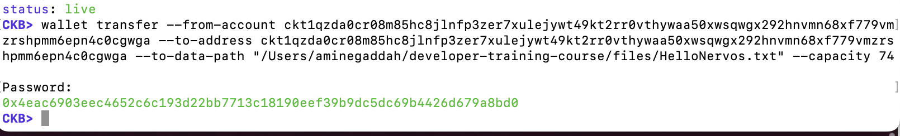

# Week 02 Report – GADDAH Amine – June 30–July 6, 2025

## What I Did

- Installed all necessary tools and dependencies for running the CKB dev chain and working with `ckb-cli`.
- Successfully sent a basic transaction and transferred **100,000 CKBytes**.
- Examined transactions, determined, and validated the out points.
- Continued the course "L1 Developer Kit" up to the **"Introduction to Capsule"** section (I skipped the Lumos programming parts).

### 🧾 Transaction Details from `ckb-cli` – 100,000 CKBytes Transfer

### Verifying File Hash and Live Cell Data with `blake2b` and `ckb-cli`

### Checking Live Cell Status via `rpc get_live_cell`

### Sending a Transaction with File Attachment Using `wallet transfer`

