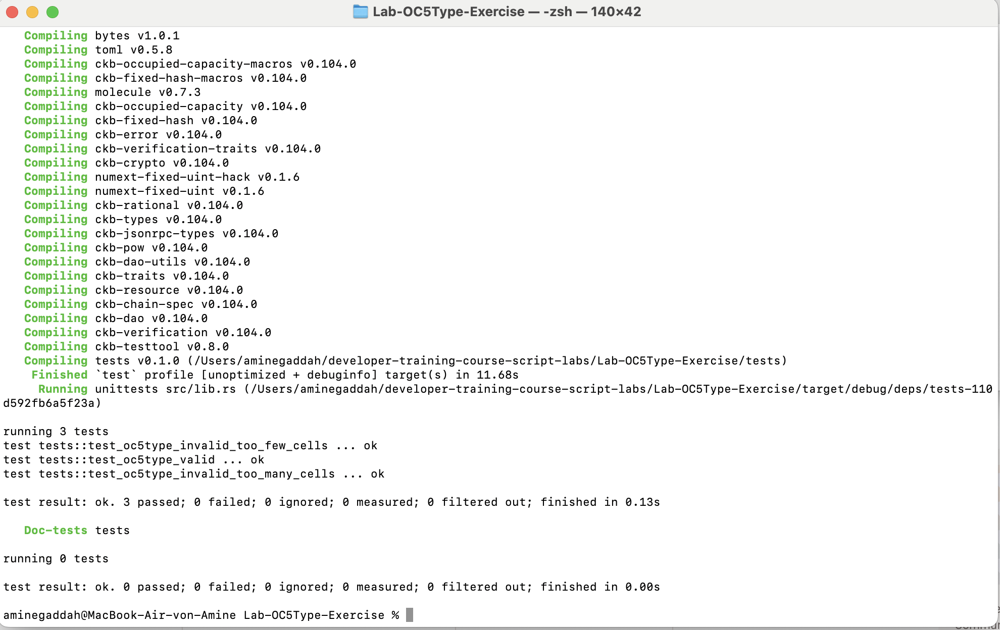
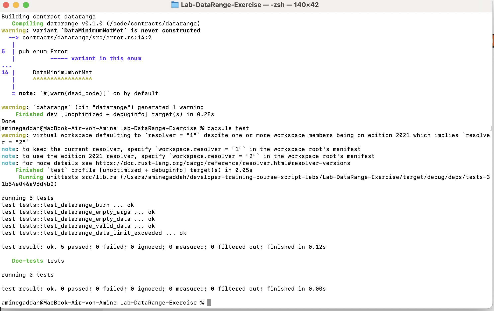
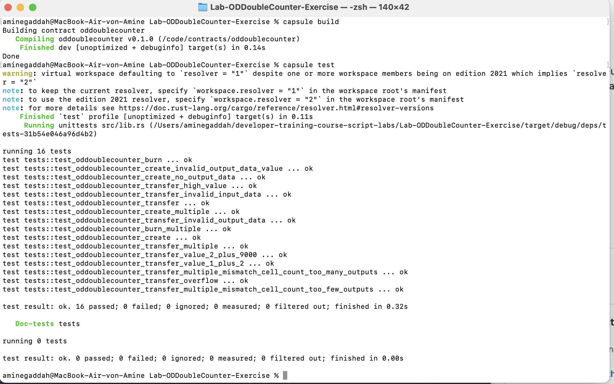

# Week 03 Report – GADDAH Amine –July 7-13, 2025

## What I Did

- Enrolled in a Rust programming course on Udemy — currently 50% complete.
-  Progressed through the LA Developer Toolkit — reached the last lesson "Creating a Token".
- Completed LAB1 to LAB5 (excluding any involving Lumos) without checking the provided solutions.

### LAB1 (Convert IC3Type to OC5Type) Execution Output  

### LAB2 (Convert DataCap to DataRange) Execution Output

### LAB3 (Convert the Counter to a Double Counter) Execution Output

### LAB4 (Convert the Double Counter to an Aggregatable Double Counter) Execution Output

### LAB5 (Add Operation Detection to the Double Counter) Execution Output

## What I Learned

- Understood the basic structure of a project.
- Learned about high-level functions and syscalls, and why Rust is often preferred over C in this context.
- Understood why grouping cells (group input and group output) is more efficient for transaction logic, and how using `QueryIter` to iterate through existing cells simplifies the process.
- Improved my understanding of numerical conversions (e.g., Base64, Base128) through labs.
- Gained a better grasp of ownership concepts in Rust by working through hands-on examples.
- Built experience in handling and troubleshooting errors while testing capsules.

## Challenges I Faced

## Challenges I Faced

- Initially installed the wrong version of Capsule (v0.10 instead of the required v0.9), which caused  issues.
- Learning Rust is challenging, as it is closer to the machine and introduces unique concepts like ownership and borrowing — concepts not present in the languages I’m more familiar with, such as Python, C, and Java.

## Gols for Next Week

- Complete the **Rust course in Udemy**.
- Construct and successfully send my **first custom CKB transaction** from scratch.
