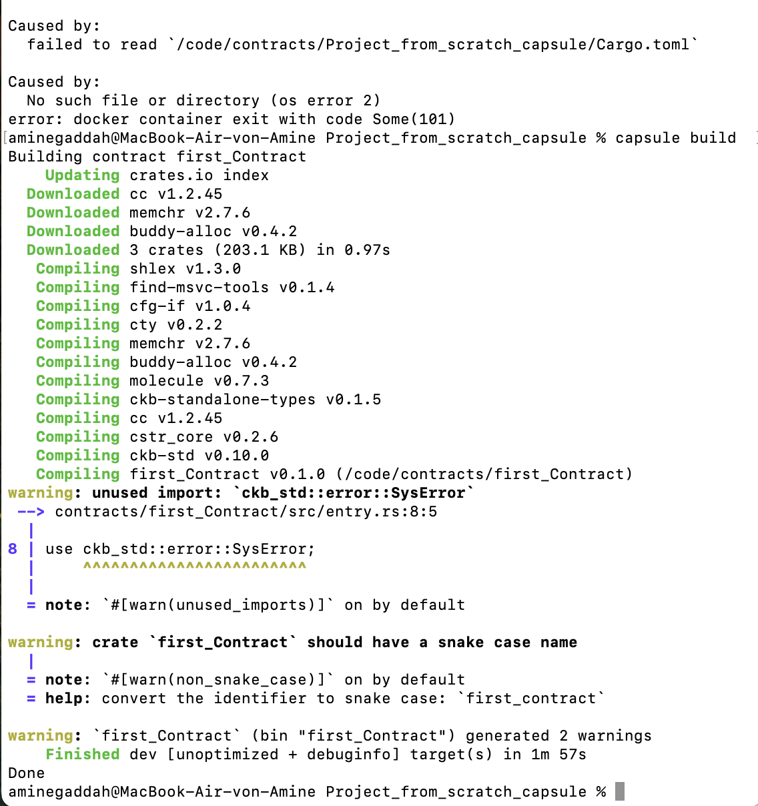
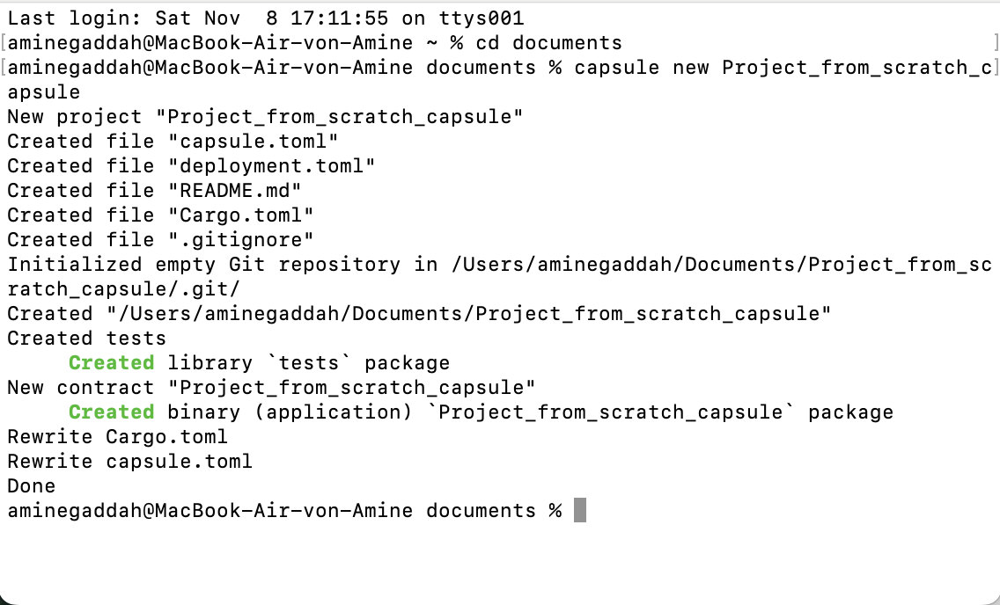
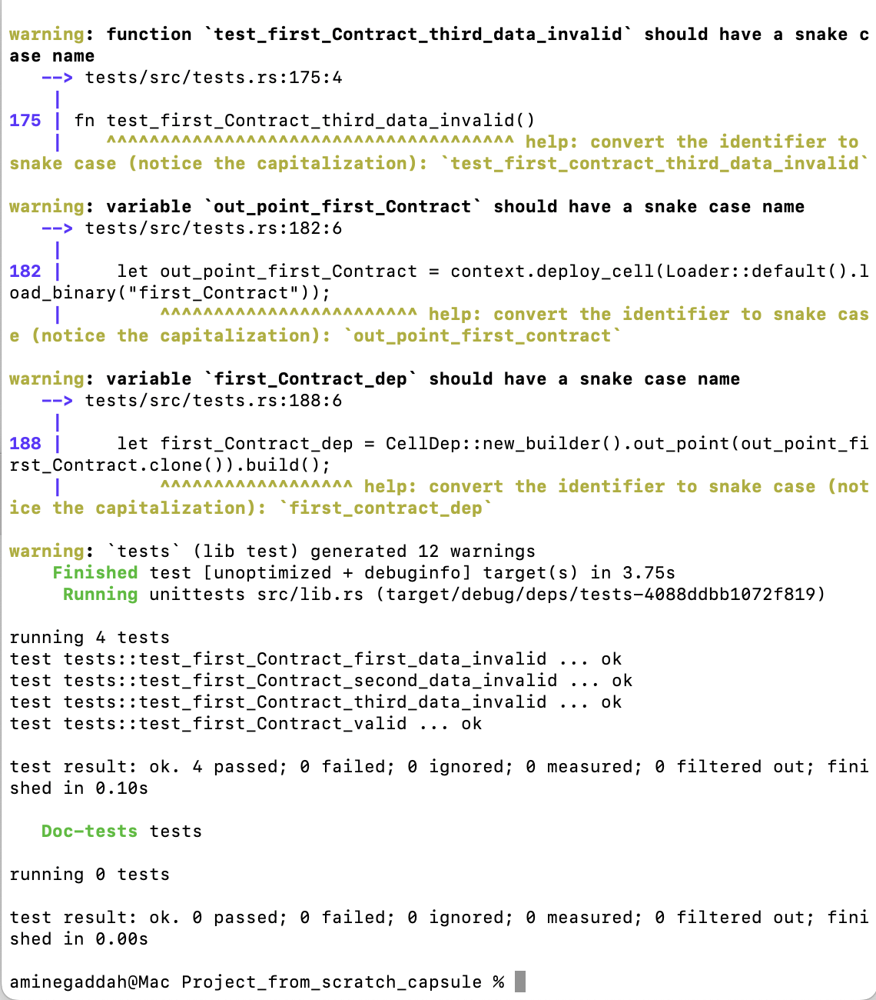

# Week 08 Report – SENNARIA IMANE – November 03–09, 2025

## What I Did

- Until now, we had only modified the TypeScript files. This week, for the first time, we directly modified `entry.rs` and `test.rs`.
- Installed Capsule and set up the development environment.
- Created a new smart contract project using Capsule.
- Implemented the contract by editing the following Rust source files:
  - `entry.rs`
  - `main.rs`
  - `lib.rs`
  - `tests/` (test files)

## What I Learned

- Gained a clearer understanding of the role of each Rust file (`entry.rs`, `main.rs`, `lib.rs`) in structuring a smart contract.
- Learned how to write basic tests in Rust:
  - One test confirmed that the contract behaves correctly with valid input.
  - Another test confirmed that invalid input is correctly rejected.
- Learned how to run and interpret test results in Rust using Capsule.

## Challenges I Faced

## Important Files

- [`entry.rs`](./entry.rs)
- [`tests.rs`](./tests.rs)  

## Results

This was a basic example that we worked on, but the main purpose was to understand the underlying concepts and structure of what we’re doing.
## Goals for Next Week

- Learn the basics of JavaScript, as it's important for smart contract interactions and tooling in the suite.
-  Build and test a new contract and a contract off-chain (Off-CKB).
-  Start working on a more complex contract .
