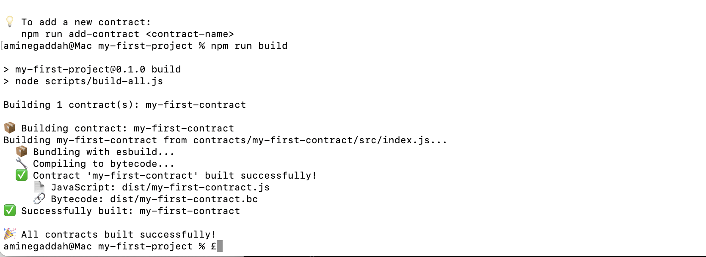
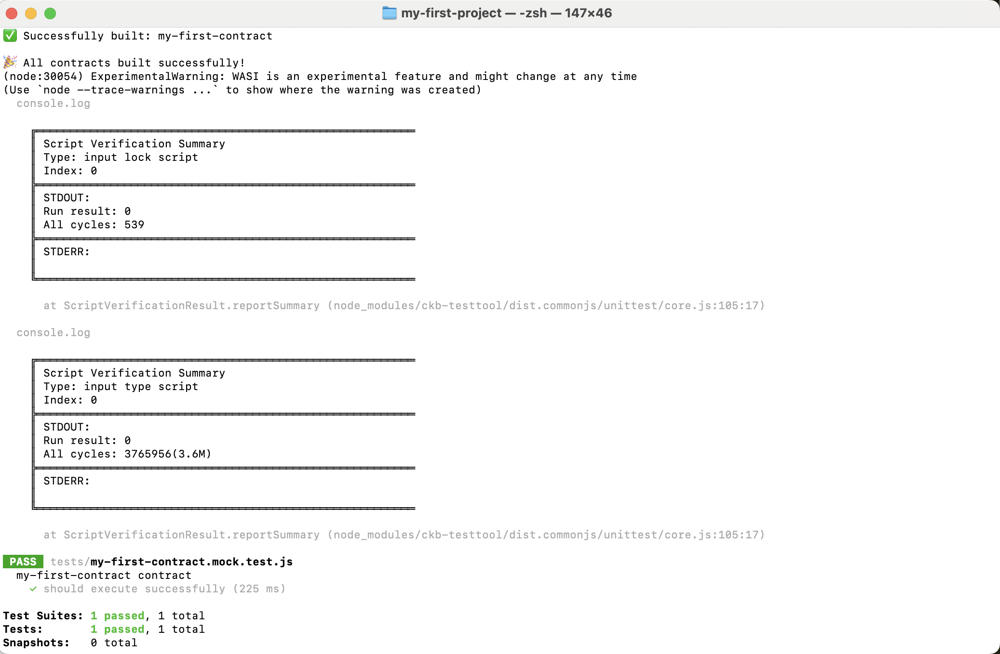
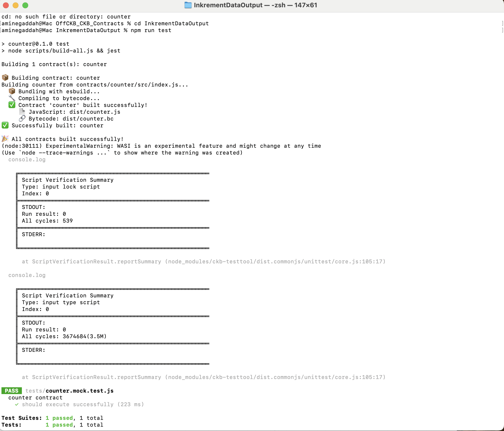

#  Week 09 Report – Amine GADDAH  
**November 10–16, 2025**

##  What I Did
- Worked with **OFFCKB** using **JavaScript**.
- Repeated the same workflow as Week 08, but implemented fully in JavaScript:
  - Built the smart contract  
  - Deployed it  
  - Tested it  

## What I Learned
- Learned the basics of **JavaScript**, since I started using it this week.
- Revisited the entire process (build → deploy → test) using JavaScript.
- Gained a clearer understanding of how the **off-chain workflow** works with OFFCKB.

##  Important Files
- [`index.js`](./index.js)
- [`my-first-contract.mock.test.js`](./my-first-contract.mock.test.js)
- [`index2.js`](./index2.js)
- [`counter.mock.test.js`](./counter.mock.test.js)

##  Results

Tests ran successfully:

This was a **basic example**, similar to Week 08, but the main purpose was to redo the workflow using **JavaScript**.

##  Goals for Next Week
- Continue learning **JavaScript basics**.
- Build and test a **new smart contract** and its **off-chain code (CCC)**.
- Start working on a more **complex contract**.
