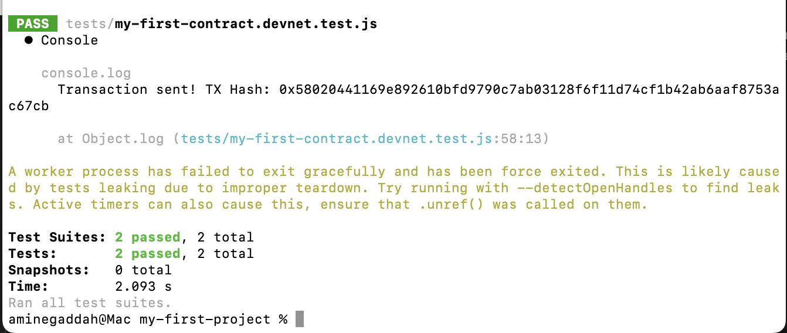
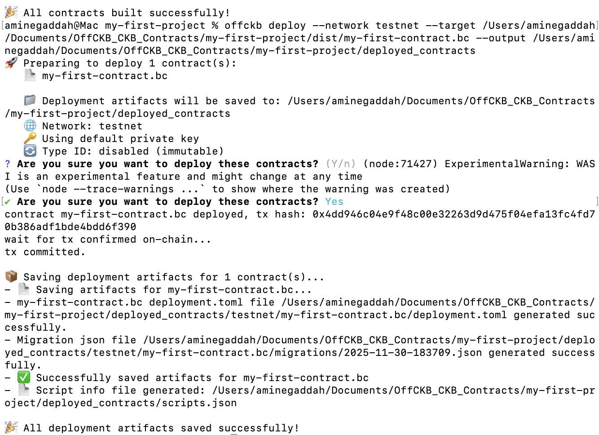
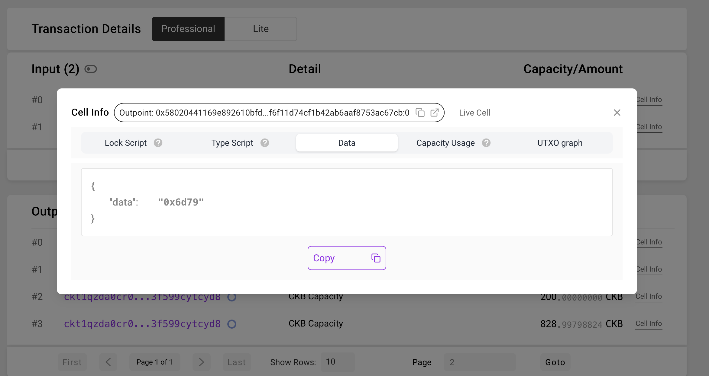
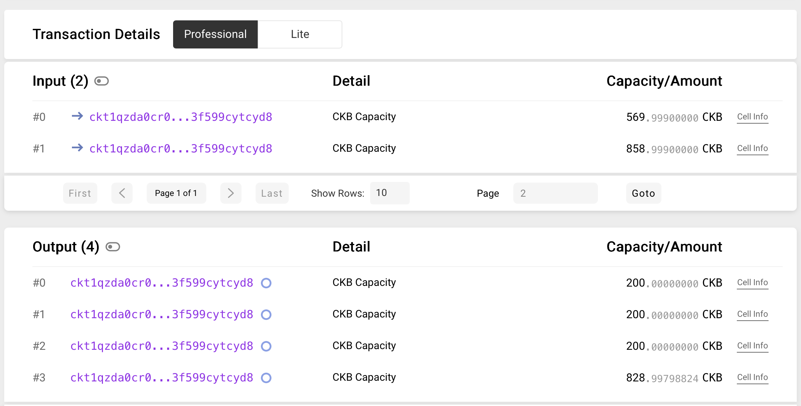

# Week 10 Report – GADDAH Amine  
**November 17 – December 1, 2025**

##  What I Did

### 1. Built my JavaScript smart contract (`testCCC`)
I successfully bundled and compiled my TypeScript/JavaScript contract using **esbuild**, generating the `.bc` bytecode file.

---

### 2. Installed and configured all required CKB tools
The installation of **ckb-debugger** was challenging due to missing dependencies (`protoc`) and PATH issues. Multiple errors occurred before the installation succeeded.

---

### 3. Attempted to run tests on Devnet – Failed
Running tests on Devnet caused this error because **ckb-js-vm is NOT deployed on Devnet**.

---

### 4. Successfully deployed the contract on Testnet
Since ckb JS VM  is not deployed in Devnet, I deployed the smart contract on **Testnet** instead.

**Command used:**

offckb deploy --network testnet --target dist/testCCC.bc
### 5. Executed tests on Testnet

The test successfully sent a transaction: 

TX Hash: 0x3b7720df175b7b2b21336041a7659d23cd0d5f781d9f2d9b483a6e84ef93704e

### 6. Transaction detail on CKB explorer
-  Data section

The data stored in the output cell 0:

0x6d79

-  Type Script section 

Displays:

##  Important Files
- [`system-scripts.json`](./system-scripts.json)
- [`scripts.json`](./scripts.json)

## Challenges I Faced

    - Missing protoc

    - SSL timeout during installation

    - ckb-debugger: command not found

    -The ckb-js-vm is not deployed on Devnet. We could have used Devnet we only needed to retrieve the binary file ckbfile.bc, but since the contract is already deployed on Testnet, we proceeded to deploy our construct directly on Testnet.

    - Some dependencies required Node 20+

## Results

    - Contract built successfully
    - Successful deployment on Testnet
    - Testnet transaction sent successfully
    - transaction detail visible on explorer
    - Identified async test issues

## Goals for Next Week
-Build a more advanced test scenario
-Begin developing a more complex JavaScript smart contract
