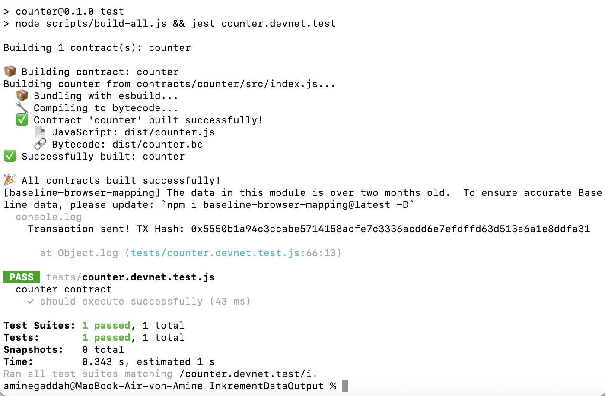
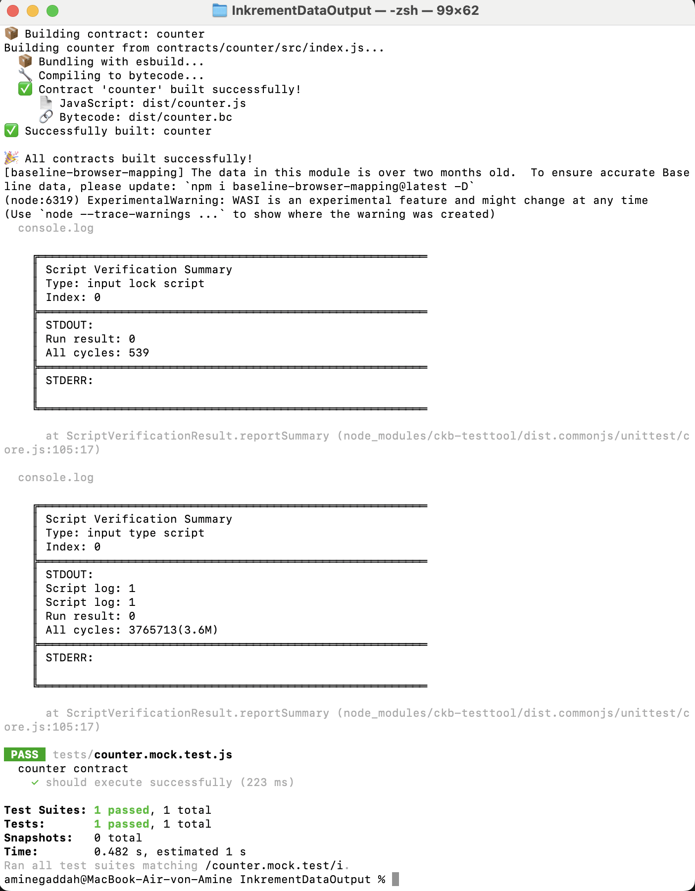
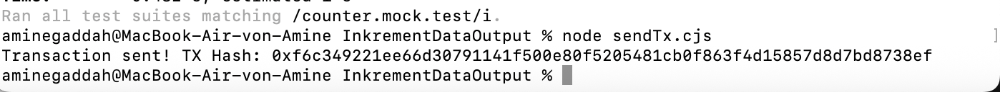

# Week 12 Report – Amine GADDAH  
**January 12–18, 2026**

# What I Did
- Worked on the **creation of the smart contract**.
- Completed and validated the contract logic after running the **mock tests**.
- Created the **genesis_counter_cell** for contract initialization.
- Implemented the transaction logic in **sendTx.cjs**.
- Deployed and tested the contract on **Devnet**.

# What I Learned
- How to create and structure a smart contract.
- The importance of **mock tests** before deployment.
- How **genesis cells** are created and used.
- How to send transactions programmatically.
- How to identify and debug wallet connector integration issues.

# Important Files
- [`Week12-index.js`](./Week12-index.js)
- [`Week12-counter.mock.test.js`](./Week12-counter.mock.test.js)
- [`Week12-sendTx.js`](./Week12-sendTx.cjs)
- [`Week12-counter.devnet.testjs`](./Week12-counter.devnet.test.js)

# Results

  

# Goals for Next Week
- Use **CCC wallet connector** instead of **JoyID wallet connector**.
- Start building the **UI**.
- Integrate the UI with the wallet and smart contract.
