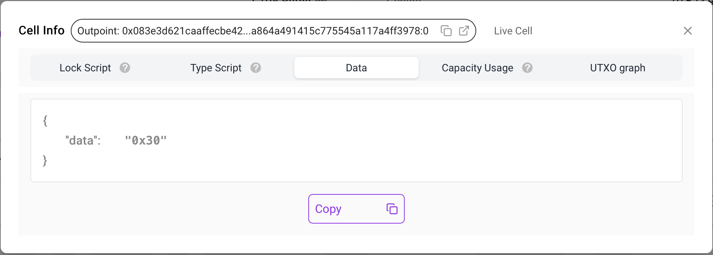
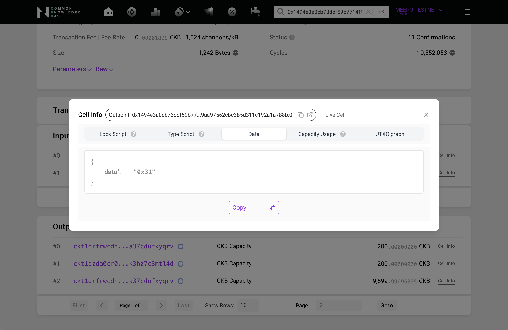
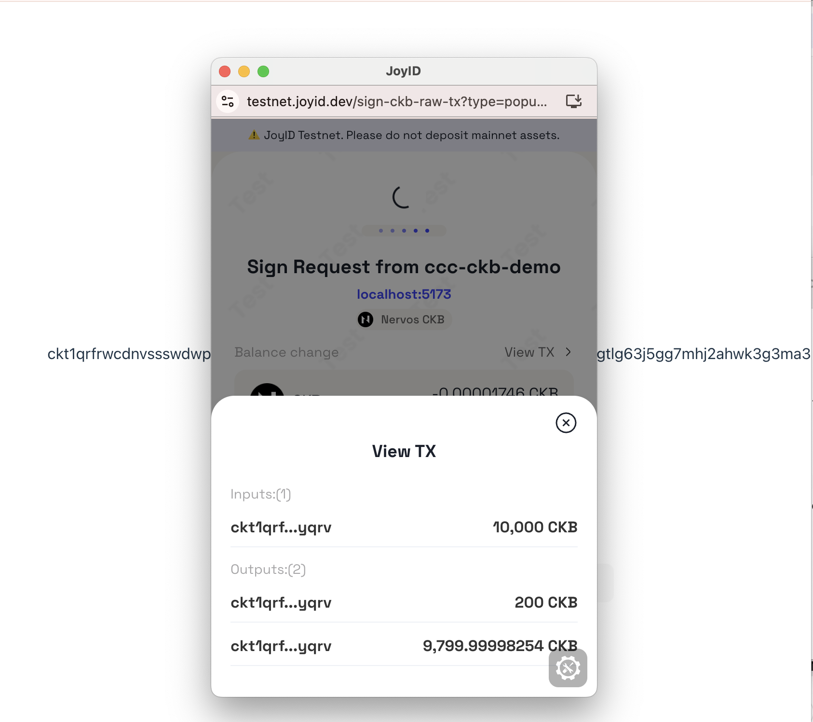
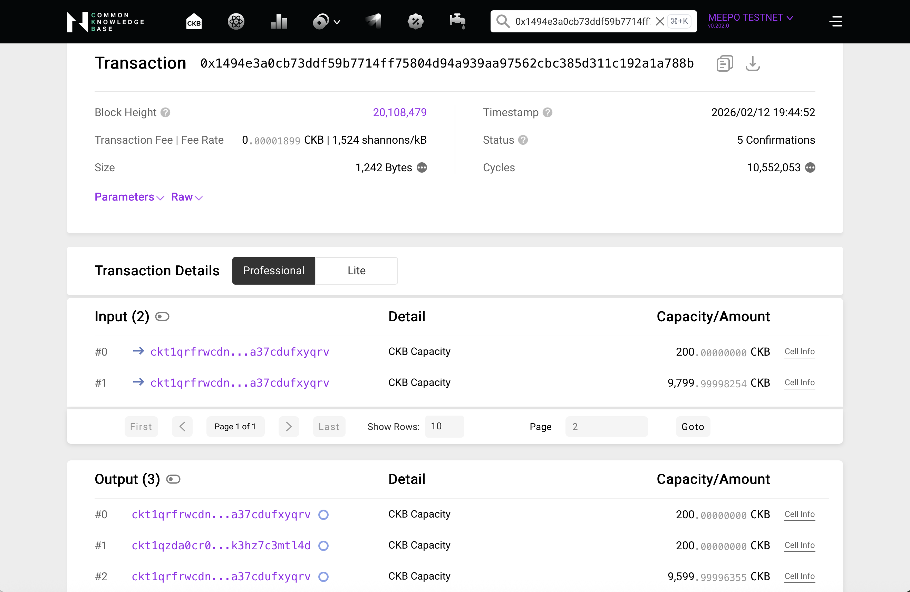
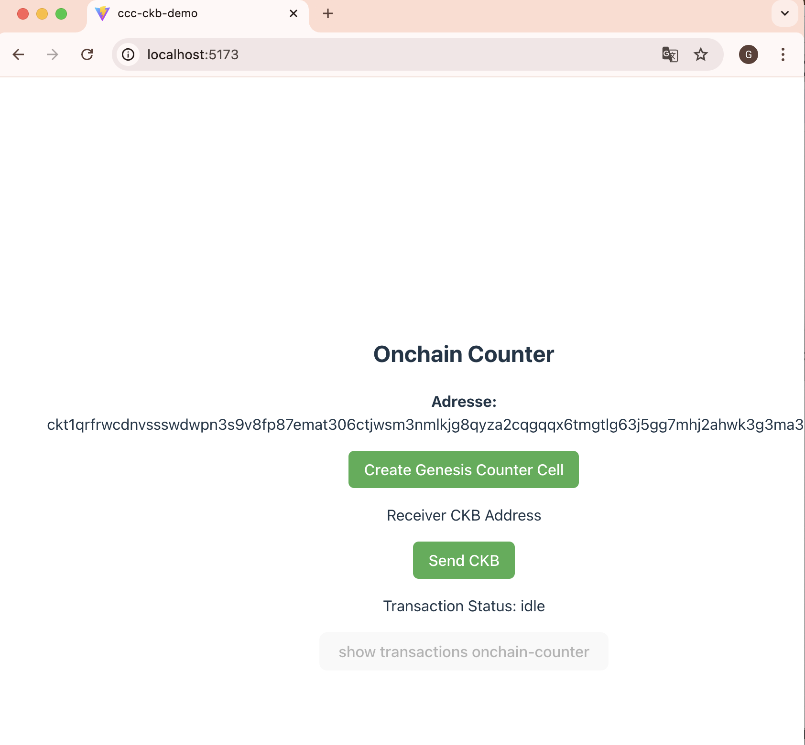
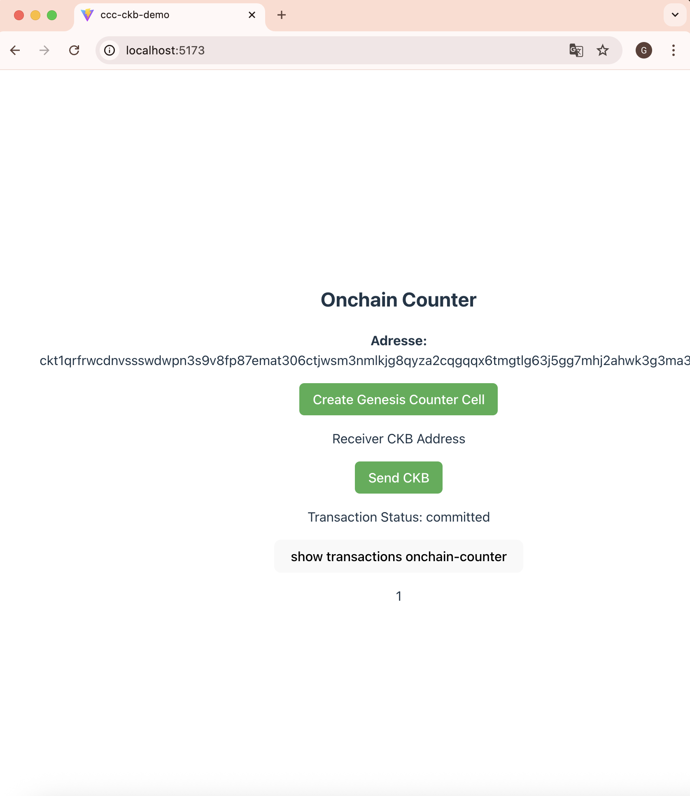
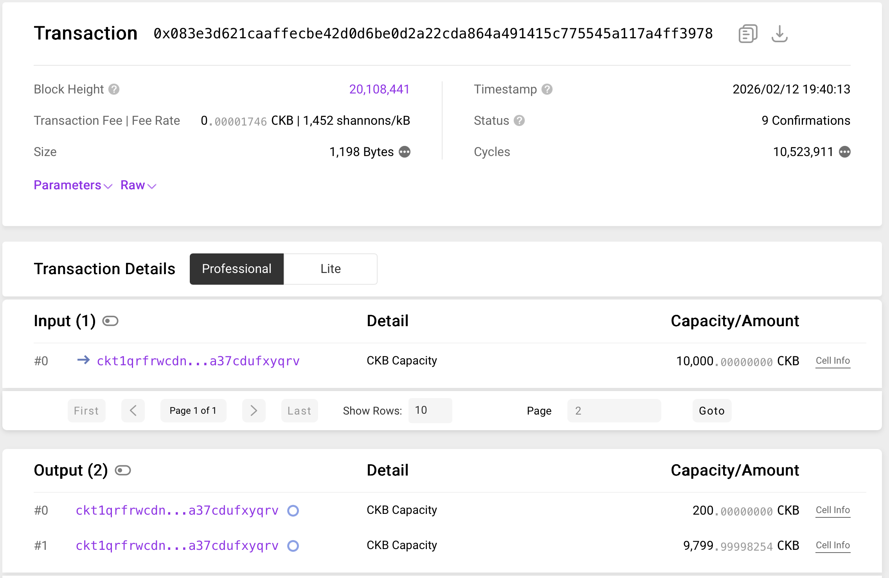
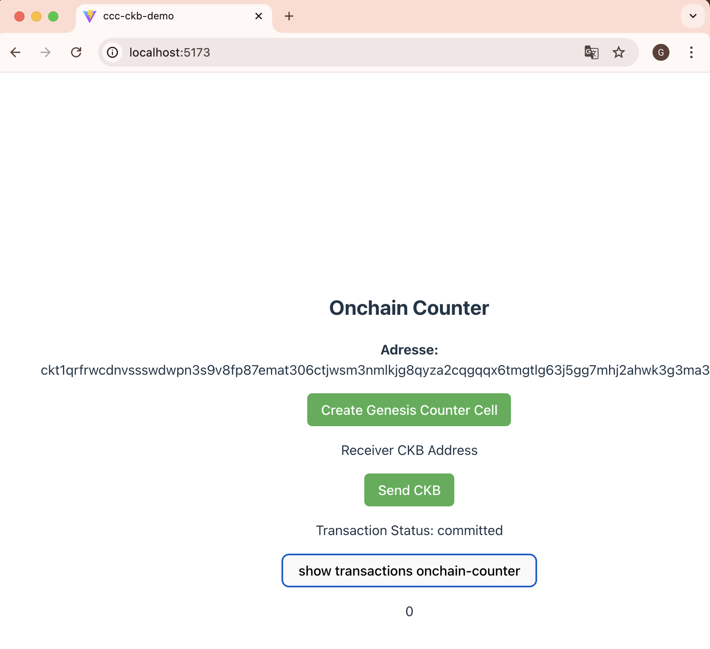

# Week 12 Report – Amine GADDAH  
**February 02–13, 2026**

# What I Did
- Created an application that enables the user to track their on-chain transactions.
- At the beginning, the user must click on "Create Genesis Counter Cell" to create a cell where the counter is initialized to 0.
- The application calculates the number of transactions made by the user on-chain.
- When the user clicks on "Show Transactions Onchain-Counter", the application displays the total number of transactions performed.
- If the user wants to reset the counter, they can click again on "Create Genesis Counter Cell", which reinitializes the counter.

# Important Files
- [`W13-App.jsx`](./W13-App.jsx)
- [`W13-index.js`](./W13-index.js)
- [`W13-main.jsx`](./W13-main.jsx)
- [`W13-SendCKB.jsx`](./W13-SendCKB.jsx)
- [`W13-TxState.jsx`](./W13-TxState.jsx)
- [`W13-Outpoint.jsx`](./W13-Outpoint.jsx)
- [`W13-OnchainCounter.jsx`](./W13-OnchainCounter.jsx)
- [`W13-CreateGenesisCell.jsx`](./W13-CreateGenesisCell.jsx

# Results

