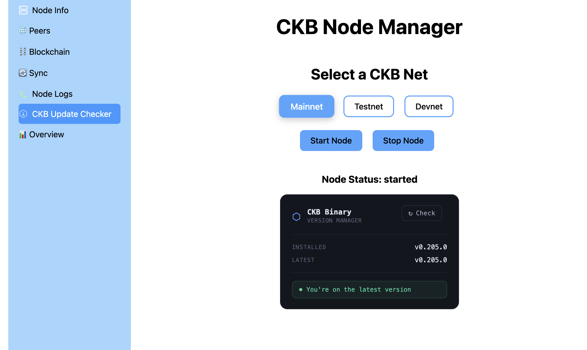
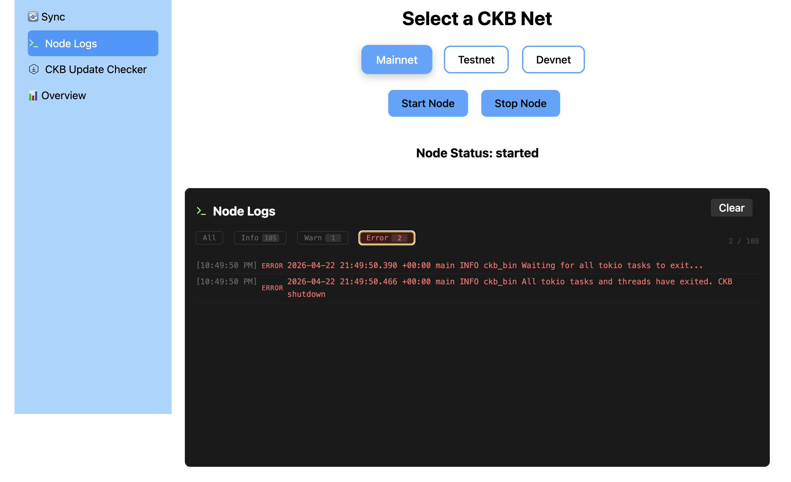
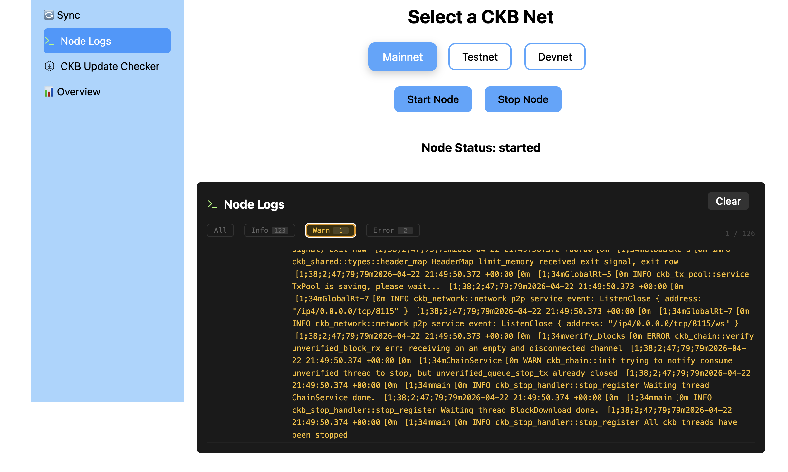

# Week 14 Report – Amine GADDAH  
**April 13–19, 2026**

# What I Did
- CKB Binary Update System added to the CKB Node Manager:
  
  The app can now check for new CKB releases and install them without the user touching the terminal. It hits the GitHub   Releases API, compares the installed        binary version against the latest release using semver, and picks the correct       asset for the current platform and architecture. The download streams the        binary to a temp directory, verifies the SHA-256 digest from the GitHub asset metadata, extracts the archive, and atomically replaces the binary using a       .new temp file before renaming. Progress is streamed to the frontend in real time via SSE with four stages: downloading       (with percentage), verifying,          replacing, and done.
- Node Logs Filter:
  
  Four filter buttons added above the log list: All, Info, Warn, and Error. Since CKB only emits info and error types from the server, warn is detected by             scanning the message text for the WARN keyword that CKB includes in its output strings. Each filter button shows a count badge of matching entries. A X / Y          counter shows visible vs total logs. Each log row now also displays a small level label between the timestamp and message.

# Important Files

- [`CkbUpdater.jsx`](./CkbUpdater.jsx)
- [`NodeLogs.jsx`](./NodeLogs.jsx)

# Results

# Goals for Next Week
- Create a new section that supports viewing and editing the ckb.toml configuration file.
