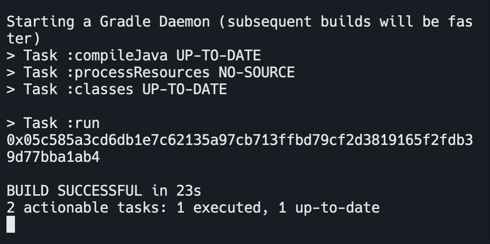
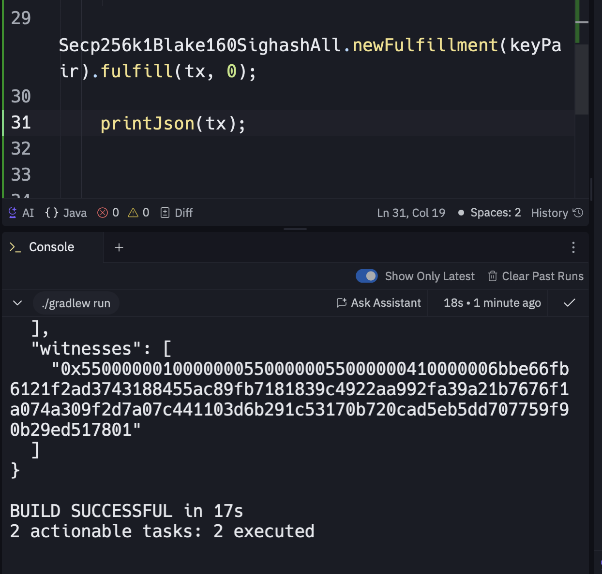
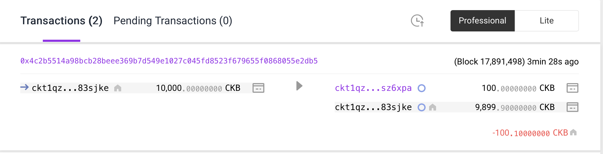
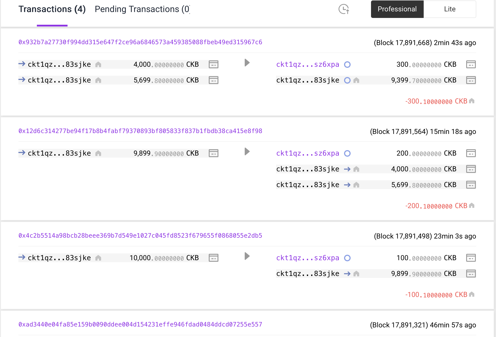

# Week 04 Report – GADDAH Amine –July 14-20, 2025

## What I Did

-Complete the module: Construct and Send Your First CKB Transaction

### Generate Key Pair Execution Output  

### Add witnesse  

### Send a Transaction

### Sent Transactions

## What I Learned

I’ve learned how to create and send a basic transaction using Java.

## Challenges I Faced

- No challenges this week

