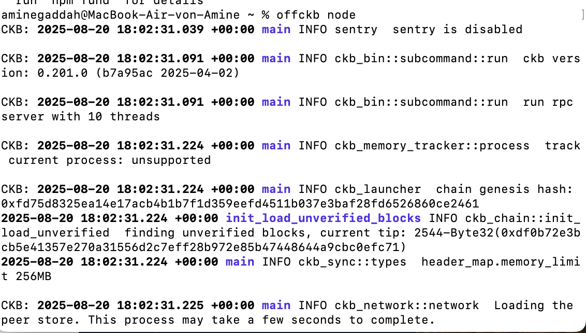
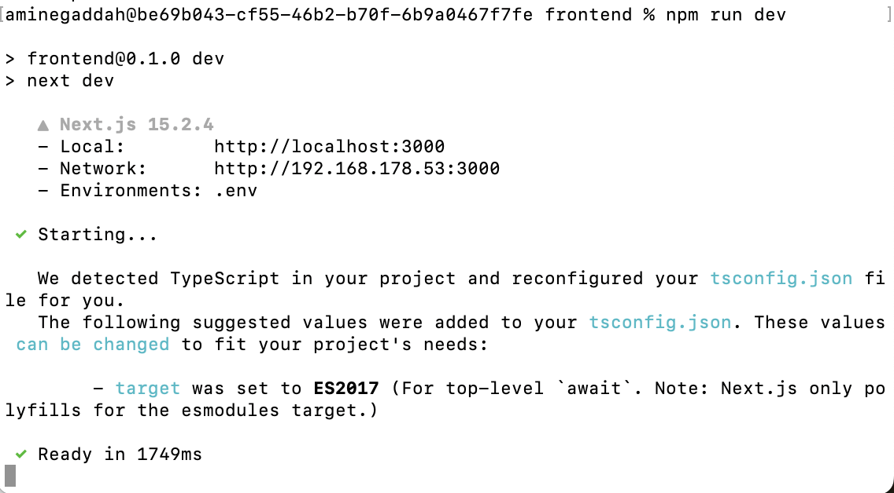
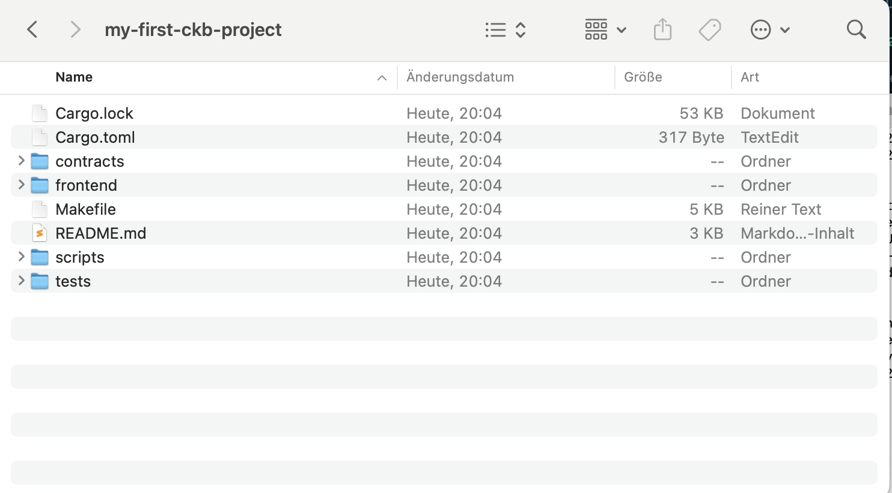
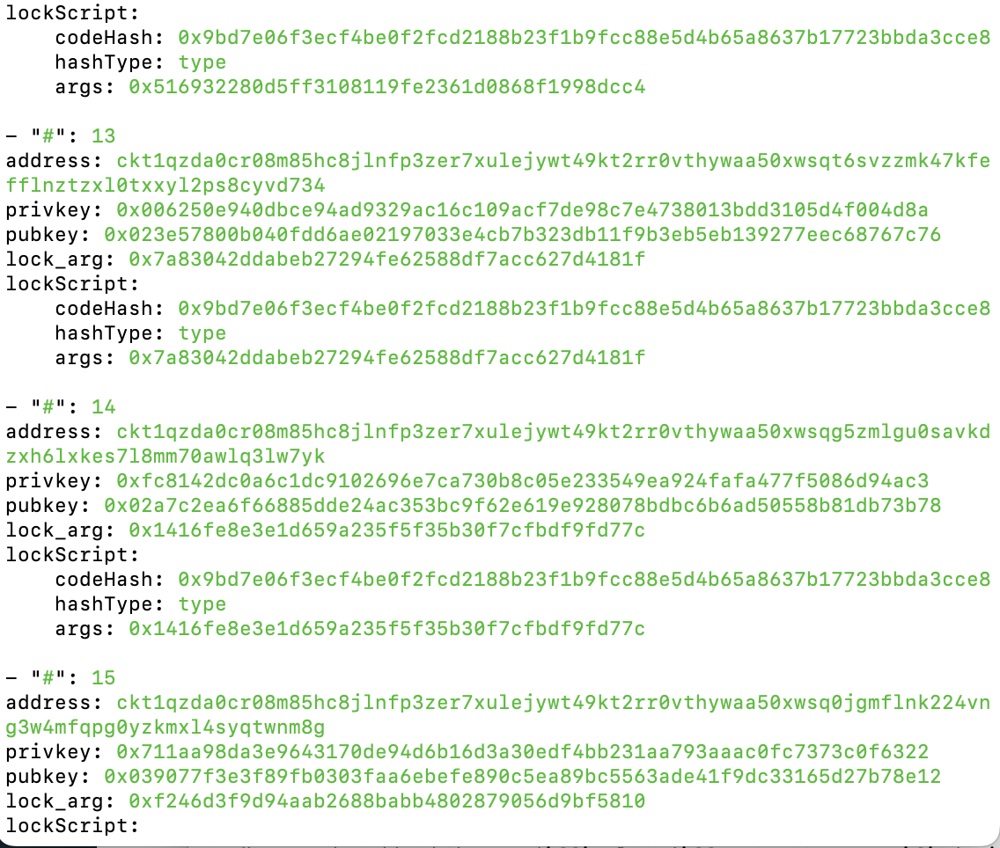
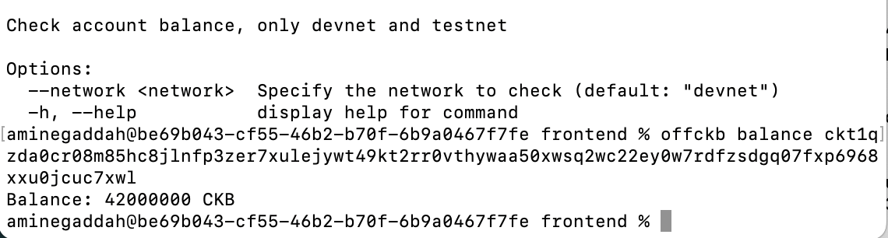
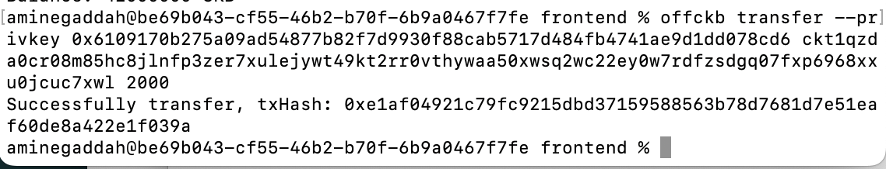
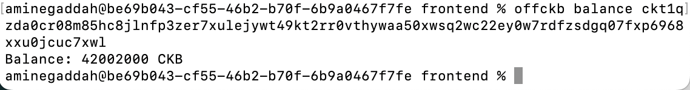
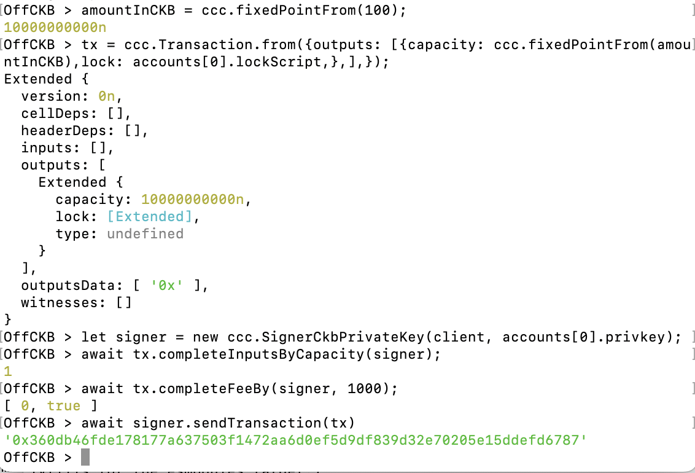

# Week 06 Report – GADDAH Amine –August 11-17, 2025

## What I Did

-Starting with offCKB environement

### Run Of CKB Node 

### Run Devnet offckb  

### Create CKB Project

### prefounded Test Accounts

### Check balance of account 16

### Transfer 2000 CKB from Account 0 to Account 16

### Balance of Account 16 after Transfer

### Building a Transaction with Offckb REPL

## What I Learned

I’ve learned how to create and send a basic transaction using offCKB.

## Challenges I Faced

- No challenges this week
